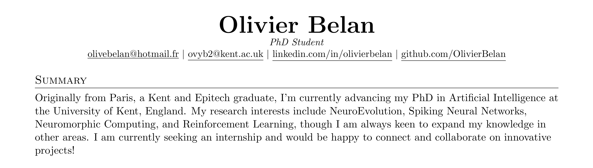

## Hi there 👋

### Originally from Paris, a Kent and Epitech graduate, I’m currently advancing my PhD in Artificial Intelligence at
the University of Kent, England. My research interests include NeuroEvolution, Spiking Neural Networks,
Neuromorphic Computing, and Reinforcement Learning, though I am always keen to expand my knowledge in
other areas. I am currently seeking an internship and would be happy to connect and collaborate on innovative
projects!

<!-- add imgae -->
<!--  -->

## 👨🏾‍🏫 Please find my full resume [here](CV_Olivier_Belan.pdf) 🔬

<!-- 

 -->

<!--
**OlivierBelan/OlivierBelan** is a ✨ _special_ ✨ repository because its `README.md` (this file) appears on your GitHub profile.

Here are some ideas to get you started:

- 🔭 I’m currently working on ...
- 🌱 I’m currently learning ...
- 👯 I’m looking to collaborate on ...
- 🤔 I’m looking for help with ...
- 💬 Ask me about ...
- 📫 How to reach me: ...
- 😄 Pronouns: ...
- ⚡ Fun fact: ...
-->
